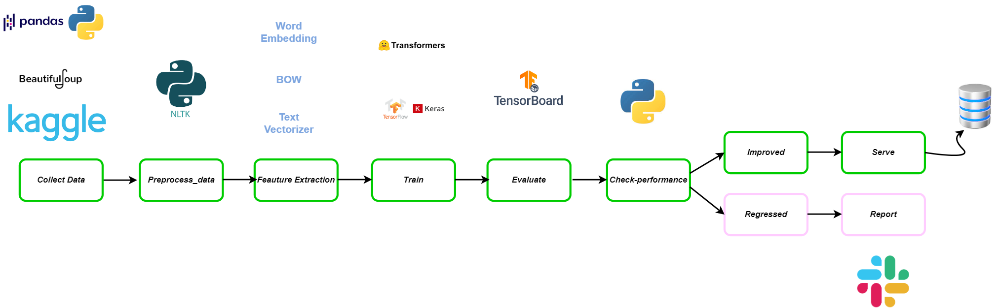
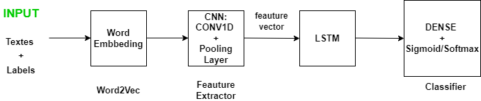

# Test technique(DEEP LEARNING)

## Question 1 :

Pipeline de détection de langage abusif sur un réseau social :
On va décrire un pipeline de détection de langage abusif sur Twitter
1.	Collect Data : télécharger un jeu de données contenant des textes + labels des commentaires d’un réseau social (Kaggle Dataset Excel/csv file) ou on peut utiliser le web scraping pour construire notre propre jeu de données (Sélenium, Beautiful Soup...)
2.	Load Data : charger le jeu de données avec Pandas (raw data)
3.	Preprocessing : 
a-	Lower case
b-	Remove punctuations
c-	Remove stopwords
d-	Stemming & Lemmatization
4.	Feauture Extraction : Tokenisation : BOW / Word Embeedings / Transformers
5.	Modeling : on peut soit créer notre propre modèle de classification (binaire) à base de RNN (LSTM/BILSTM) soit fine tuner un modèle d’état d’art (Hugging Face Transformers : https://huggingface.co/SkolkovoInstitute/roberta_toxicity_classifier) sur notre dataset.
6.	Evaluation : Calculer les métrics nécessaires pour évaluer les performances de notre modèle
7.	Déploiement : on peut utiliser un stack complet pour automatiser notre workflow et le mener à la phase de production en utilisant MLflow, AutoML, FastAPI
8.	Faire des inférences/prédictions

## Question 2 :

Processus permettant d’utiliser un algorithme hybride CNN-LSTM pour détecter un contenu agressif dans une publication :

Le but de cette tâche est de reconnaître les termes agressifs contenus dans une publication particulière. Cela rend cette tâche difficile en raison des différences de vocabulaire et des contextes associés. Pour cela on va utiliser concevoir un modèle à base de réseaux de neurones CNN et LSTM. L’architecture de notre modèle est représentée dans la figure suivante :
  

## Question 3 :
Implémentez en utilisant python3 un connecteur Facebook et/ou Instagram permettant de colleter des postes (image,
texte et commentaires liés aux images) par rapport à un sujet défini, exemple « le décès du président Jacques Chirac ».
Il est recommandé de stocker les textes et les images dans une base MongoDB. Le but de cette question est d’évaluer la
qualité de votre code source

## Réponse :
On va implémenter une application capable de se connecter soit à Facebook soit à Instagram et de collecter les postes
(image, texte et commentaires liés aux images) par rapport à un sujet défini "keyword" et ensuite les enregistrés 
dans une base MongoDB